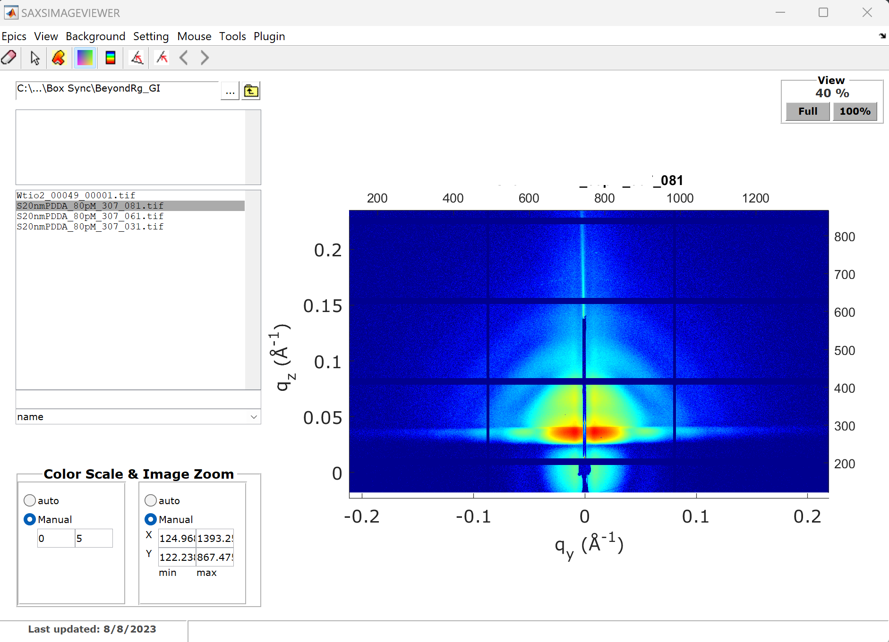

# SAXSimagviewer
A matlab tools for image visualization and reduction of APS 12ID data

# Installation
## Requirement
1. SAXSLee package (https://github.com/byeongdu/SAXSLee)
2. HDF5 plugin ("Installation" tab on https://12idb.xray.aps.anl.gov/Software_Processing.html)
## Matlab Path Setting
Once this repository is cloned and fetched, open matlab and addpath those directories and subdirectories (if not familiar with the matlab path definition, have a look at https://12idb.xray.aps.anl.gov/Software_Processing.html, Installation tab).

# Tutorial
Youtube video [https://www.youtube.com/watch?v=YqPlq5E5yKk] is available. It might be out-dated, but still useful to understand its working principle.

# Disclaimer
This software may employee certain assumptions for efficiency in calculation and visualization and does not guarantee accuracy. Use with your own caution. 
